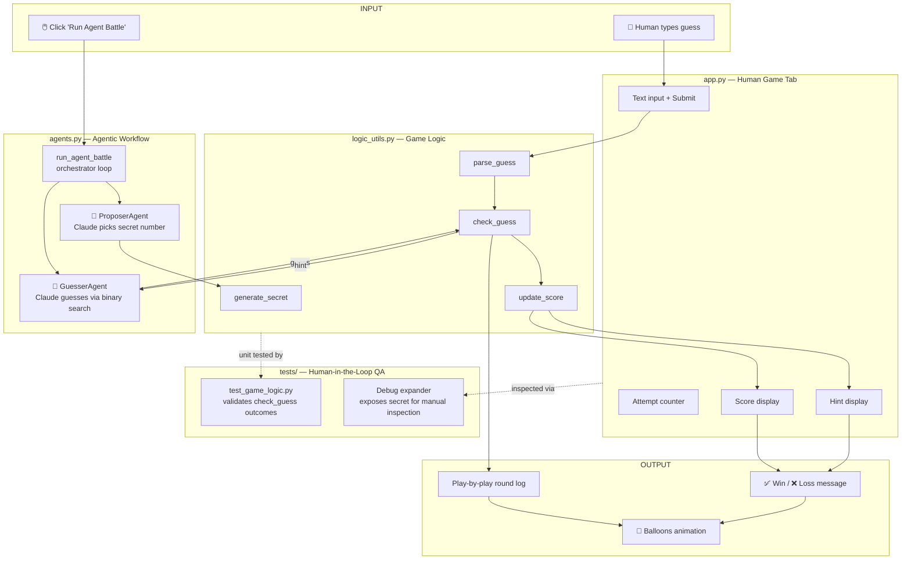

```mermaid
flowchart TD
    subgraph INPUT
        A[👤 Human types guess]
        B[🖱️ Click 'Run Agent Battle']
    end

    subgraph LOGIC["logic_utils.py — Game Logic"]
        L1[generate_secret]
        L2[parse_guess]
        L3[check_guess]
        L4[update_score]
    end

    subgraph HUMAN["app.py — Human Game Tab"]
        H1[Text input + Submit]
        H2[Attempt counter]
        H3[Hint display]
        H4[Score display]
    end

    subgraph AGENTS["agents.py — Agentic Workflow"]
        P[🤖 ProposerAgent\nClaude picks secret number]
        G[🤖 GuesserAgent\nClaude guesses via binary search]
        O[run_agent_battle\norchestrator loop]
    end

    subgraph OUTPUT
        R1[✅ Win / ❌ Loss message]
        R2[Play-by-play round log]
        R3[🎈 Balloons animation]
    end

    subgraph TESTING["tests/ — Human-in-the-Loop QA"]
        T1[test_game_logic.py\nvalidates check_guess outcomes]
        T2[Debug expander\nexposes secret for manual inspection]
    end

    A --> H1 --> L2 --> L3 --> L4 --> H3 & H4 --> R1
    B --> O
    O --> P --> L1
    O --> G
    G -- "guess" --> L3
    L3 -- "hint" --> G
    L3 --> R2
    R1 & R2 --> R3

    LOGIC -.->|unit tested by| T1
    HUMAN -.->|inspected via| T2
```
